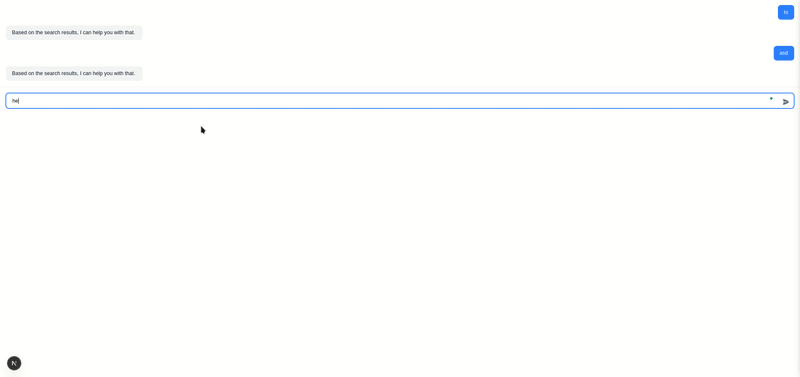

# Chat UI with Streaming Responses

A modern chat application with streaming responses, built using Next.js, FastAPI, and SQLite. This project demonstrates a complete chat interface with real-time message streaming, tool usage tracking, and persistent chat history.

## Demo GIF



## Project Structure

```
chat-ui-extracted/
├── backend/
│   ├── app/
│   │   └── db/
│   │       ├── base.py      # Database configuration
│   │       ├── models.py    # SQLAlchemy models
│   │       └── init_db.py   # Database initialization
│   ├── main.py             # FastAPI application
│   └── requirements.txt    # Python dependencies
└── src/                    # Next.js frontend
    ├── app/               # Next.js app directory
    ├── components/        # React components
    │   └── chat/         # Chat-specific components
    │       ├── chat-provider.tsx    # Chat context and state management
    │       ├── composer.tsx         # Message input component
    │       └── message-list.tsx     # Message display component
    └── lib/              # Utility functions and types
```

## Features

### Backend

1. **FastAPI Server**
   - Streaming responses using Server-Sent Events (SSE)
   - RESTful API endpoints for chat management
   - CORS support for frontend integration

2. **Database (SQLite)**
   - Two main tables:
     - `Chats`: Stores chat session metadata
     - `ChatMessages`: Stores individual messages with tool information
   - Support for:
     - Message streaming
     - Tool usage tracking
     - Chat history persistence

3. **API Endpoints**
   - `POST /chat`: Create/continue a chat with streaming responses
   - `GET /chats`: List all chats
   - `GET /chats/{chat_id}/messages`: Get all messages for a specific chat

### Frontend

1. **Next.js Application**
   - Modern React-based UI with TypeScript
   - Real-time message streaming
   - Chat history management
   - Tool usage visualization

2. **Key Components**
   - `ChatProvider`: Manages chat state and streaming
   - `MessageList`: Displays chat messages with streaming support
   - `Composer`: Handles message input and submission

3. **Features**
   - Real-time message streaming
   - Message history persistence
   - Tool usage visualization
   - Responsive design
   - Type-safe development with TypeScript

## Database Schema

### Chats Table
```sql
CREATE TABLE chats (
    id TEXT PRIMARY KEY,
    created_at TIMESTAMP DEFAULT CURRENT_TIMESTAMP,
    title TEXT,
    model TEXT NOT NULL,
    chat_metadata JSON
);
```

### ChatMessages Table
```sql
CREATE TABLE chat_messages (
    id INTEGER PRIMARY KEY AUTOINCREMENT,
    chat_id TEXT REFERENCES chats(id) ON DELETE CASCADE,
    ts TIMESTAMP DEFAULT CURRENT_TIMESTAMP,
    role TEXT NOT NULL,
    content TEXT NOT NULL,
    tool_name TEXT,
    tool_args JSON,
    partial_json JSON
);
```

## Setup Instructions

### Backend Setup

1. Create and activate virtual environment:
```bash
cd backend
python3 -m venv venv
source venv/bin/activate
```

2. Install dependencies:
```bash
pip install -r requirements.txt
```

3. Initialize the database:
```bash
python -m app.db.init_db
```

4. Start the server:
```bash
uvicorn main:app --reload
```

### Frontend Setup

1. Install dependencies:
```bash
npm install
```

2. Start the development server:
```bash
npm run dev
```

## API Usage Examples

1. List all chats:
```bash
curl http://localhost:8000/chats
```

2. Get messages for a specific chat:
```bash
curl http://localhost:8000/chats/{chat_id}/messages
```

3. Create a new chat with streaming response:
```bash
curl -X POST http://localhost:8000/chat \
  -H "Content-Type: application/json" \
  -d '{
    "messages": [
      {"role": "user", "content": "Hello!"}
    ],
    "model": "gpt-4"
  }'
```

## Streaming Response Format

The chat endpoint streams responses in the following format:

```json
data: {"type": "tool_started", "content": "Starting web search..."}
data: {"type": "tool_delta", "content": "Found relevant information..."}
data: {"type": "tool_finished", "content": "Web search completed."}
data: {"type": "delta", "content": "Based "}
data: {"type": "delta", "content": "on "}
...
data: {"type": "chat_message_complete", "content": ""}
```

## Development Status

- [x] Project Setup & Persistence
  - [x] Repo bootstrap with core components
  - [x] FastAPI app with SSE streaming
  - [x] Database schema and models
  - [x] Database initialization and seeding

- [x] Streaming Tool Implementations
  - [x] Web search tool with Perplexity integration
  - [x] Interview search tool with Pinecone integration
  - [x] Frontend tool call visualization

- [ ] Polishing & Table-Side Integration
  - [ ] Chat Sheet implementation
  - [ ] Theming and styling
  - [ ] Persistence demo
  - [ ] Documentation updates

## Next Steps

1. Implement Chat Sheet component using shadcn
2. Add theming support with Tailwind config
3. Integrate chat with existing spreadsheet
4. Add documentation for tool integration
5. Implement persistence demo

## Contributing

1. Fork the repository
2. Create a feature branch
3. Commit your changes
4. Push to the branch
5. Create a Pull Request
